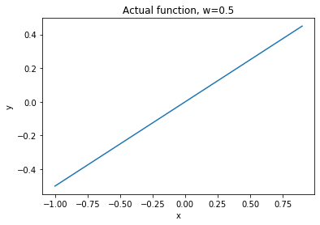
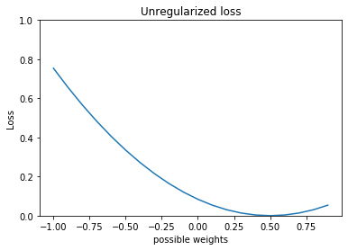
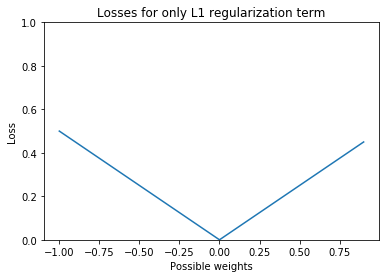
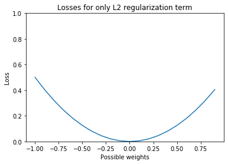
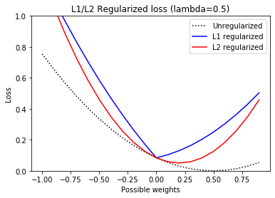

# L1 and L2 Regularization Visualized
## A better visualization of comparisons between L1 (lasso) and L2 (ridge) regularization and why L1 regularization shrinks weights to 0.  
### The Old Way
You often hear the saying "L1 regularization tends to shrink the coefficients of unimportant features to 0, but L2 does not" in all the good explanations of regularization as seen in [here](https://towardsdatascience.com/l1-and-l2-regularization-methods-ce25e7fc831c) and [here](https://towardsdatascience.com/intuitions-on-l1-and-l2-regularisation-235f2db4c261). Visual explanations usually consist of this very popular picture from Figure 3.11 from Elements of Statistical Learning by Hastie, Tibshirani, and Friedman,  
   
also seen here in Pattern Recognition and Machine Learning by Bishop .  
I have found these diagrams unintuitive, and so made a simpler one that feels much easier to understand.
### The New Way
Here's my take, step by step with visualizations. First of all, the images above are actually 3 dimensional, which does not translate well onto a book or screen. Instead, let us do this with a 2 dimensional model.  
1. Create a really simple model with just one weight. y=w*x.  
  
2. Calculate the loss (mean squared error) for various values of w.  
  
3. Let us now our loss functions. L1 loss is 0 when w is 0, and increases linearly as you move away from w=0. On the other hand, L2 loss increases non-linearly as you move away from w=0.  
 
4. Now the fun part. Regularization is applied by adding your loss term with your regularization term. Doing this for each of our losses above gets us the blue (L1) and red (L2) curves below. You can tell that in the case of L1 loss (blue line), the value of w that minimizes the loss is at 0. For L2 loss (red line), the value of w that minimizes the loss is lower than the actual value (which is 0.5), but does not quite hit 0.  
  
Another way of thinking about this is that L1 regularization adds a fixed gradient at every value other than 0, while the gradient of L2 regularization decreases as we approach 0. Therefore, at values of w that is very close to 0, gradient descend with L1 regularization continues to push w towards 0, while gradient descend on L2 weakens the closer you are to 0.

